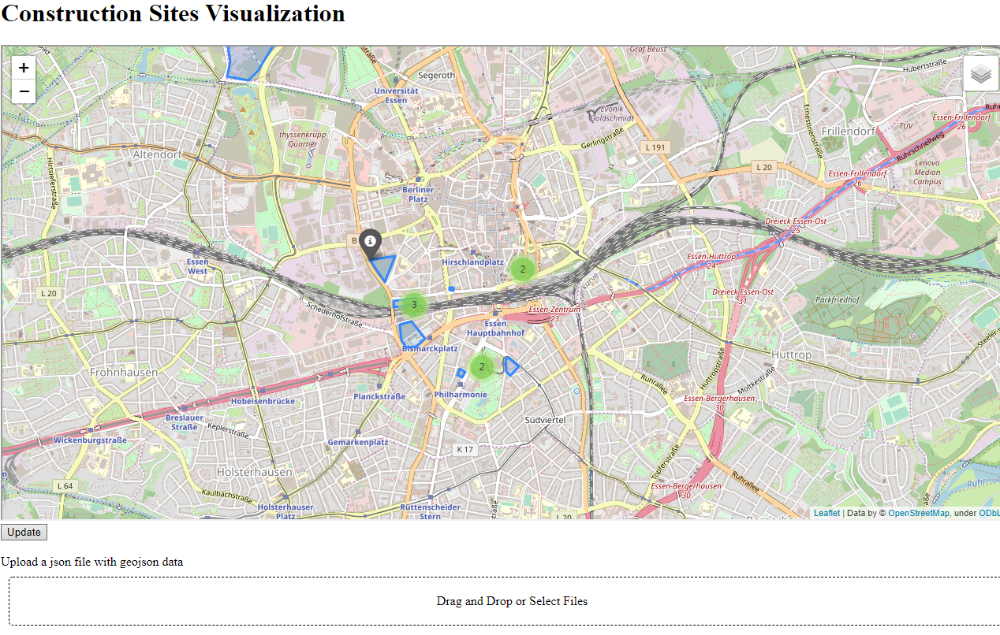

# construction_sites_map
Using folium and dash to display constructions sites and planned projects on OSM maps

## Idea
Enable easy creation of markers and polygons on maps to mark locations of constructions sites and other interesting spots.
The projects purpose is mainly to play around with the Python modules.

## Implementation
Using Python modules
* https://python-visualization.github.io/folium/quickstart.html
* https://dash.plot.ly/?_ga=2.63984175.1693067226.1579282663-51681835.1574148326

The app provides the possibility to upload a card (json data) containing geojson data together with project status and a link to the project page.
On upload the json data are stored along the app. Clicking on the update button triggers a callback which gets all stored cards and creates polygons on the map from the geojson data and marker for the status containing the link.

## Example
Examples of cards can be found in folder project_cards. The coordinates are generated using http://geojson.io/#map=2/20.0/0.0.

 
